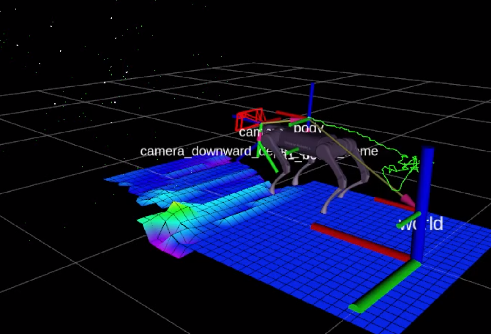

A1_visualizer

This visualizer visulize your A1 robot in rviz

Dependency:

Other than ROS itself (only tested in ROS melodic)

1. tranform graph  https://github.com/jstnhuang/transform_graph
2. orocos_kdl      https://github.com/orocos/orocos_kinematics_dynamics
3. unitree sdk     https://github.com/unitreerobotics/unitree_ros

The visualizer will search for unitree ros package installed on your machine, then read urdf from unitree ros package. 

Please make sure you can roscd unitree_legged_real before running this package.

It also read a unitree_legged_msgs::LowState topic "a1/debug_state"

The visualization result looks like this:

(The camera frame and points in the scene comes from VINS-Fusion. They are not part of this package)